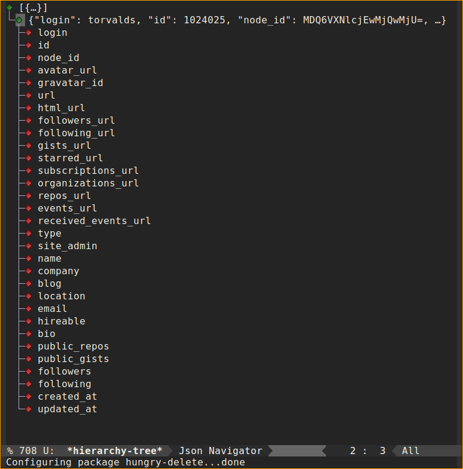
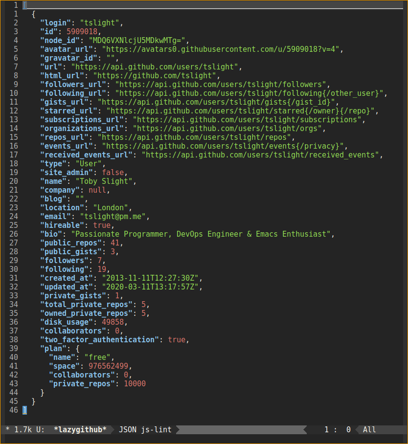

* Emacs API Clients for GitHub & GitLab

#+CAPTION: Results of CI workflow
#+NAME: fig: ci-bad
#+LINK: https://github.com/tslight/lazygit.el/actions
[[https://github.com/tslight/lazygit.el/workflows/CI/badge.svg]]

** Overview

So far I have implemented functions to clone or pull repositories from a list
of repositories available to the authenticated user, with
~lazygitlab-clone-or-pull-repo~ or ~lazygithub-clone-or-pull-repo~.

If [[https://magit.vc/][Magit]] is installed, this will be used, otherwise we shell out to ~git~, so
obviously, that needs to be installed on your system.

You can clone or pull all repositories in one fail swoop with
~lazygithub-clone-or-pull-all~ or ~lazygitlab-clone-or-pull-all~. This will not use
[[https://magit.vc/][Magit]], unless called with prefix argument.

For GitLab you can also clone or pull all the repositories under a given group
with ~lazygitlab-clone-or-pull-group~. This will not use [[https://magit.vc/][Magit]], unless called with
prefix argument.

~lazygitlab-retriever~ and ~lazygithub-retriever~ allow arbitrary querying of
endpoints. If [[https://github.com/DamienCassou/json-navigator][json-navigator]] is installed, the JSON results will be opened in a
fancy tree hiearchy browser. If not you can view the JSON results pretty
printed in a dedicated buffer.

*N.B.* /I have only tested this on Emacs 27... Feedback running on other
versions greatly appreciated/

** Authentication

You will be asked to enter your /Personal Access Token/ the first time you run
a command.

Generate a *GitHub* /Personal Access Token/ [[https://github.com/settings/tokens][here]].

Generate a *GitLab* /Personal Access Token/ [[https://gitlab.com/profile/personal_access_tokens][here]].

By default these tokens will be stored in ~$HOME/.emacs.d/.gitlab.token~ and
~$HOME/.emacs.d/.github.token~, however these locations can be customised with
~customize~ or ~setq~.

** Configuration

If you just want GitHub access:

#+begin_src emacs-lisp
  (add-to-list 'load-path "/path/to/where/you/cloned/this/repo")
  (require 'lazygithub)
  ;; optionally change the default personal access token location
  (setq lazygithub-token-file "~/.github.key")
#+end_src

If you just want GitLab access:

#+begin_src emacs-lisp
  (add-to-list 'load-path "/path/to/where/you/cloned/this/repo")
  (require 'lazygitlab)
  ;; optionally change the default personal access token location
  (setq lazygitlab-token-file "~/.gitlab.key")
#+end_src

If you want both GitHub & GitLab access:

#+begin_src emacs-lisp
  (add-to-list 'load-path "/path/to/where/you/cloned/this/repo")
  (require 'lazygit)
  ;; optionally change the default personal access tokens locations
  (setq lazygitlab-token-file "~/.gitlab.key")
  (setq lazygithub-token-file "~/.github.key")
#+end_src

*** Use Package

#+begin_src emacs-lisp
  (use-package lazygit
    :load-path "/path/to/where/you/cloned/this/repo")

  (use-package lazygitlab
    :after lazygit
    :commands gl/all gl/api gl/grp gl/prj
    :bind
    ("C-c g l a" . lazygitlab-clone-or-pull-all)
    ("C-c g l g" . lazygitlab-clone-or-pull-group)
    ("C-c g l c" . lazygitlab-clone-or-pull-project)
    ("C-c g l r" . lazygitlab-retriever)
    :config
    (setq lazygitlab-token-file "~/.gitlab.key"))

  (use-package lazygithub
    :after lazygit
    :commands gh/all gh/api gh/repo
    :bind
    ("C-c g h a" . lazygithub-clone-or-pull-all)
    ("C-c g h c" . lazygithub-clone-or-pull-repo)
    ("C-c g h r" . lazygithub-retriever)
    :config
    (setq lazygithub-token-file "~/.github.key"))
#+end_src

** Screenshots

Results of running ~(lazygithub-retriever "user/torvalds")~ when [[https://github.com/DamienCassou/json-navigator][json-navigator]] is
installed:

#+CAPTION: Results of lazygithub-retriever user
#+NAME:fig:lazygithub-retriever

Results of running ~(lazygithub-retriever "user/torvalds")~ when [[https://github.com/DamienCassou/json-navigator][json-navigator]] is not
installed:

#+CAPTION: Results of lazygithub-retriever user
#+NAME:fig:lazygithub-retriever

