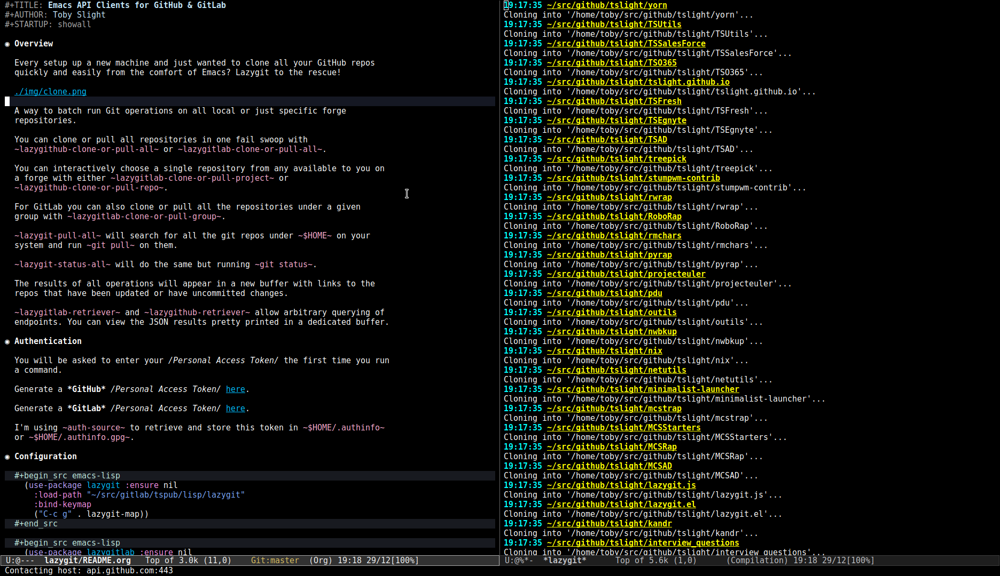
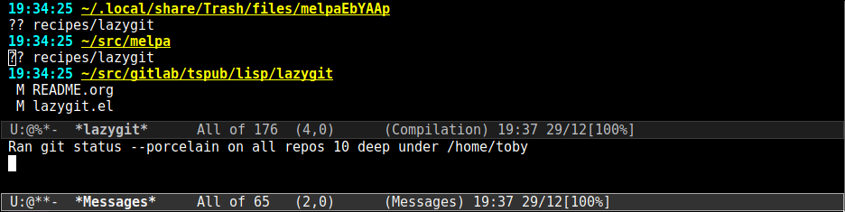
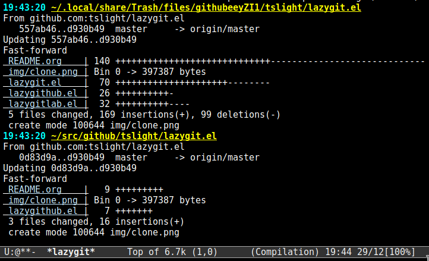

#+TITLE: GitHub & GitLab API Clients for Lazy Emacsers
#+AUTHOR: Toby Slight
#+STARTUP: overview
* Overview

  Ever setup up a new machine and just wanted to clone all of your GitHub repos
  or GitLab projects (or groups) quickly and easily from the comfort of Emacs?

  /Lazygit to the rescue.../

  

  Ever been multi-tasking like a mofo, in lots of different projects, and
  wondered how much work you hadn't committed to git yet?

  /Lazygit to the rescue.../

  

  Ever started the day and wished you could just quickly update all the Git
  repos on your machine in one fail swoop with an Emacs command?

  /Lazygit to the rescue.../

  

  Lazygit provides commands to batch run Git operations on all local or just
  specific forge repositories.

  Clone or pull all repositories from GitHub or GitLab:

  ~lazygithub-clone-or-pull-all~
  ~lazygitlab-clone-or-pull-all~

  Choose a single repository from any available to you on a forge:

  ~lazygitlab-clone-or-pull-project~
  ~lazygithub-clone-or-pull-repo~

  For GitLab you can also clone or pull all the repositories under a given
  group with ~lazygitlab-clone-or-pull-group~.

  ~lazygit-pull-all~ will search for all the git repos under ~$HOME~ on your
  system and run ~git pull~ on them.

  ~lazygit-status-all~ will do the same but running ~git status~.

  The results of all operations will appear in a new buffer with button links
  to the repos that have been updated or have uncommitted changes, so you can
  quickly jump to the project directory.

** BONUS

  ~lazygitlab-retriever~ and ~lazygithub-retriever~ allow arbitrary querying of
  endpoints. You can view the JSON results pretty printed in a dedicated
  buffer.

  This is pretty handy if you happen to be a frustrated DevOps/GitOps engineer
  trying to write automation tools targetting GitHub or GitLab's APIs...

* Authentication

  You will be asked to enter your /Personal Access Token/ the first time you run
  a command.

  Generate a *GitHub* /Personal Access Token/ [[https://github.com/settings/tokens][here]].

  Generate a *GitLab* /Personal Access Token/ [[https://gitlab.com/profile/personal_access_tokens][here]].

  I'm using ~auth-source~ to retrieve and store this token in ~$HOME/.authinfo~
  or ~$HOME/.authinfo.gpg~.

* Configuration

  #+begin_src emacs-lisp
    (use-package lazygit :ensure nil
      :load-path "~/src/gitlab/tspub/lisp/lazygit"
      :bind-keymap
      ("C-c g" . lazygit-map))
  #+end_src

  #+begin_src emacs-lisp
    (use-package lazygitlab :ensure nil
      :load-path "~/src/gitlab/tspub/lisp/lazygit"
      :bind-keymap
      ("C-c l" . lazygitlab-map))
  #+end_src

  #+begin_src emacs-lisp
    (use-package lazygithub :ensure nil
      :load-path "~/src/gitlab/tspub/lisp/lazygit"
      :bind-keymap
      ("C-c h" . lazygithub-map))
  #+end_src

* Default Keybindings

  #+begin_src text
    C-c g p         lazygit-pull-all
    C-c g s         lazygit-status-all
  #+end_src

  #+begin_src text
    C-c l p         lazygitlab-pull-all
    C-c l r         lazygitlab-retriever
    C-c l s         lazygitlab-status-all
    C-c l c a       lazygitlab-clone-or-pull-all
    C-c l c g       lazygitlab-clone-or-pull-group
    C-c l c p       lazygitlab-clone-or-pull-project
  #+end_src

  #+begin_src text
    C-c h p         lazygithub-pull-all
    C-c h r         lazygithub-retriever
    C-c h s         lazygithub-status-all
    C-c h c a       lazygithub-clone-or-pull-all
    C-c h c r       lazygithub-clone-or-pull-repo
  #+end_src
